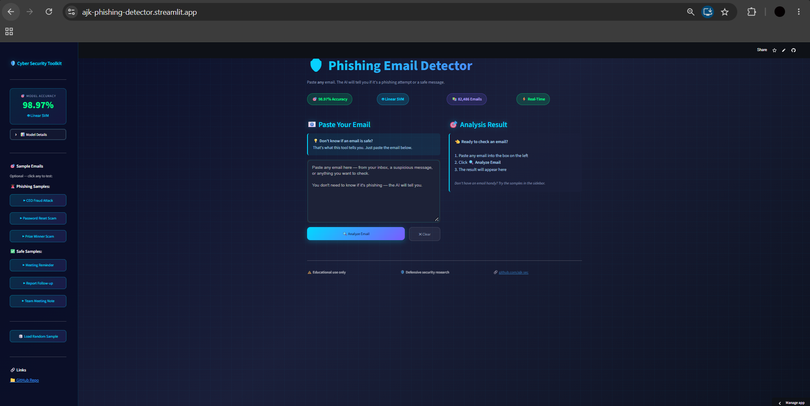
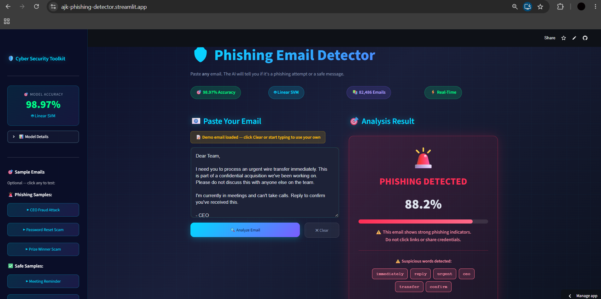
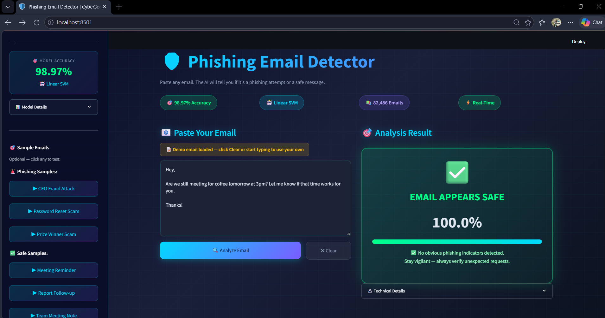
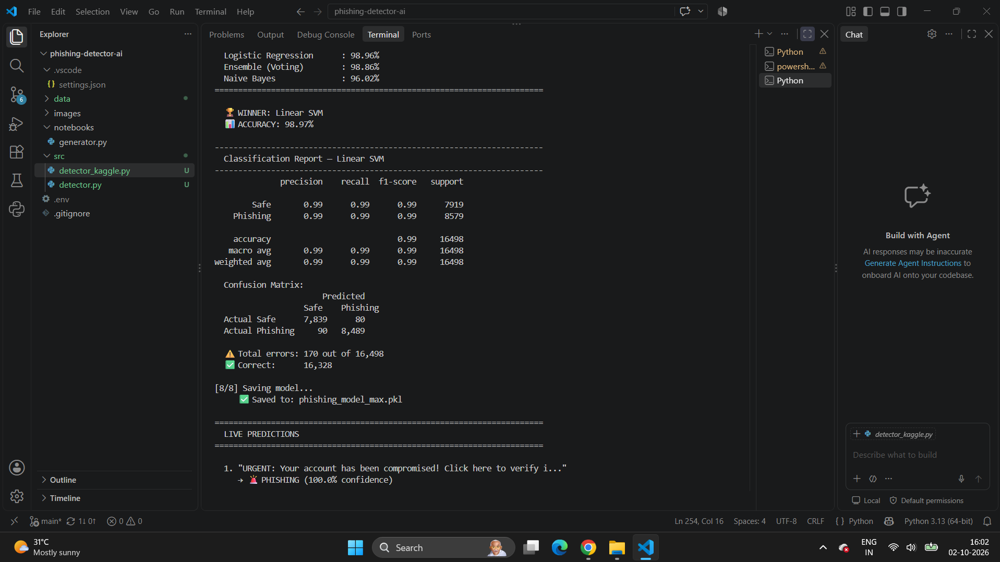

# 🛡️ AI Phishing Detector & Generator

**An AI-powered cybersecurity tool that generates phishing samples and detects phishing emails with 98.97% accuracy — deployed live on the web.**

---

## 🚀 Live Demo

**Try the app now:** 👉 **[ajk-phishing-detector.streamlit.app](https://ajk-phishing-detector.streamlit.app)**

Paste any email — the AI will tell you if it's a phishing attempt or a safe message. No signup required.

---

## 📸 Screenshots

### Dashboard
*Clean, modern interface with real-time email classification*

### Phishing Detection (with word-level explainability)
*Highlights exactly which words triggered the phishing verdict*

### Safe Email Classification
*Legitimate emails are correctly identified with high confidence*

### Model Training Results
*98.97% accuracy achieved with Linear SVM on 82,486 emails*

---

## 🎯 What This Project Does

Modern phishing attacks increasingly use AI to craft convincing, personalized emails. This project studies that threat by:

1. **Generating** realistic phishing email samples using Google's Gemini AI
2. **Analyzing** the psychological techniques used in each sample
3. **Detecting** phishing attempts using a machine learning model trained on 82,486 real emails
4. **Explaining** which words triggered the detection (word-level interpretability)

The goal: understand how AI-powered phishing works — and build defenses against it.

> ⚠️ **Educational Use Only** — All generated content is for defensive security research. No emails are ever sent to real users.

---

## 📊 Results

| Metric | Value |
|--------|-------|
| **Best Model** | Linear SVM |
| **Accuracy** | **98.97%** |
| **Training emails** | 82,486 |
| **Test emails** | 16,498 |
| **Features** | 20,000 TF-IDF (1-3 grams) |
| **Total errors** | 170 out of 16,498 |

### Model Comparison

| Model | Accuracy |
|-------|----------|
| **Linear SVM** | **98.97%** 🏆 |
| Logistic Regression | 98.96% |
| Ensemble (Voting) | 98.86% |
| Naive Bayes | 96.02% |

### Confusion Matrix

|              | Predicted Safe | Predicted Phishing |
|--------------|---------------:|-------------------:|
| **Actual Safe**     | 7,839 | 80 |
| **Actual Phishing** | 90 | 8,489 |

---

## ✨ Features

- 🤖 **AI-Powered Generation** — Uses Google Gemini API to create realistic phishing samples
- 🎯 **98.97% Accuracy** — Machine learning detector trained on 82,486 real emails
- 🔍 **Word-Level Explainability** — Shows exactly which words triggered the detection
- 🎨 **Beautiful Dashboard** — Modern cyber-themed interface with dark mode
- ⚡ **Real-Time Predictions** — Instant classification with confidence scores
- 🔒 **Secure Architecture** — API keys protected with `.env` and `.gitignore`
- 🚀 **Live Deployment** — Publicly accessible via Streamlit Cloud

---

## 🧩 Project Structure

    phishing-detector-ai/
    ├── app/
    │   └── app.py                    # Streamlit web application
    ├── data/
    │   ├── generated_emails/         # AI-generated phishing samples
    │   └── phishing_model_max.pkl    # Trained ML model
    ├── images/                       # Screenshots for documentation
    ├── notebooks/
    │   └── generator.py              # AI email generator script
    ├── src/
    │   ├── detector.py               # Phase 1 - Simple prototype
    │   └── detector_kaggle.py        # Phase 2 - Full-scale model
    ├── LICENSE
    ├── README.md
    ├── requirements.txt
    └── .gitignore

---

## 🛠️ Tech Stack

| Technology | Purpose |
|-----------|---------|
| **Python 3.13** | Core language |
| **Google Gemini API** | AI email generation |
| **scikit-learn** | Machine learning (SVM, Naive Bayes, Logistic Regression) |
| **TF-IDF Vectorizer** | Text feature extraction |
| **Streamlit** | Web application framework |
| **pandas & numpy** | Data processing |
| **python-dotenv** | Secure API key management |
| **Git & GitHub** | Version control |

---

## 🔧 Setup

### Prerequisites

- Python 3.13+
- A free [Google Gemini API key](https://aistudio.google.com/app/apikey)
- Git installed

### Local Setup

**1. Clone the repository**

    git clone https://github.com/ajk-sec/phishing-detector-ai.git
    cd phishing-detector-ai

**2. Install dependencies**

    pip install -r requirements.txt

**3. Create a `.env` file in the project root**

    GEMINI_API_KEY=your_api_key_here

**4. Get the dataset**

Download the [Kaggle Phishing Email Dataset](https://www.kaggle.com/datasets/naserabdullahalam/phishing-email-dataset) (free account required) and place `phishing_email.csv` in the `data/` folder.

> ⚠️ The dataset is ~101 MB and is not included in the repo — you must download it yourself.

**5. Train the model**

    python src/detector_kaggle.py

**6. Launch the web app**

    streamlit run app/app.py

The app will open at `http://localhost:8501`.

---

## 📖 Usage

### Using the Web App

1. Go to **[ajk-phishing-detector.streamlit.app](https://ajk-phishing-detector.streamlit.app)**
2. Paste any email text into the input box
3. Click **Analyze Email**
4. See the prediction with confidence score and highlighted suspicious words

### Using the Generator

    python notebooks/generator.py

Generated samples are saved in `data/generated_emails/`.

---

## 🎓 Lessons Learned

Building this project taught me several valuable lessons:

- **Text preprocessing matters.** Adding URL/email/phone tokenization improved accuracy from 97.99% to 98.97% — a **50% reduction in errors**.
- **Ensembles aren't always better.** My VotingClassifier (98.86%) underperformed standalone Linear SVM (98.97%). Lesson: always benchmark individual models first.
- **Deployment changes things.** A bug that didn't appear locally surfaced on Streamlit Cloud — reminding me to always test the deployed version.
- **Model explainability is powerful.** Adding word-level feature importance makes predictions understandable, building trust with users.
- **API key security is critical.** Using `.env` and `.gitignore` from day one prevented accidental credential leaks.
- **Git is a workflow, not a tool.** Committing, pushing, and pulling is a daily habit that keeps work safe and visible.
- **Data quality > model complexity.** Cleaning 82,486 emails properly mattered more than trying exotic algorithms.

---

## 🎯 Roadmap

- [x] ✅ AI email generator with Gemini API
- [x] ✅ Retry logic for API reliability
- [x] ✅ Secure API key handling (.env + .gitignore)
- [x] ✅ Machine learning phishing detector (98.97% accuracy)
- [x] ✅ Word-level explainability feature
- [x] ✅ Streamlit web app with dark cyber theme
- [x] ✅ Live deployment on Streamlit Cloud
- [ ] 🚧 Gmail API integration (future enhancement)
- [ ] 🚧 Batch email analysis
- [ ] 🚧 Mobile-optimized interface

---

## ⚠️ Ethical Notice

This project is **strictly for educational and defensive security research**. It is designed to help security professionals and students understand phishing tactics so they can build better defenses.

**Do NOT use this tool to:**
- ❌ Send phishing emails to real people
- ❌ Deceive or harm anyone
- ❌ Conduct unauthorized security testing

All generated content is for analysis only. No emails are ever sent to real users.

---

## 🙏 Acknowledgments

- **Kaggle Dataset:** [Phishing Email Dataset](https://www.kaggle.com/datasets/naserabdullahalam/phishing-email-dataset) by Naser Abdullah Alam — provided the 82,486 labeled emails for training
- **Google Gemini API** — powered the AI-generated phishing samples
- **Streamlit Community Cloud** — provided free hosting for the live demo
- **scikit-learn** — provided the machine learning framework
- **Open Source Community** — for the tools that made this project possible

---

## 📄 License

This project is licensed under the **MIT License**. See the [LICENSE](LICENSE) file for details.

---

## 👤 Author

**ajk-sec**

- 🐙 GitHub: [@ajk-sec](https://github.com/ajk-sec)
- 🚀 Live Demo: [ajk-phishing-detector.streamlit.app](https://ajk-phishing-detector.streamlit.app)
- 📁 Project: [phishing-detector-ai](https://github.com/ajk-sec/phishing-detector-ai)

---

⭐ **If you find this project useful for cybersecurity research, please give it a star!**
